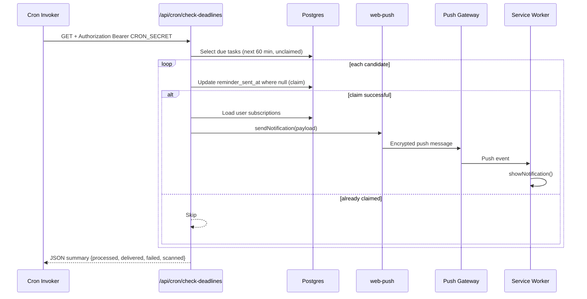

# Nexus Tasks

A private, high-discipline task command center with real-time sync and native browser push reminders.

Nexus Tasks is built for teams and individuals who want deadline reliability without surrendering control of their data plane. It combines:

- Next.js App Router server actions for low-latency mutations.
- Supabase Auth + PostgreSQL + Row Level Security for owner isolation.
- Native Web Push (VAPID signed) for vendor-gateway delivery.
- Scheduled deadline scanning with idempotent claim semantics.

No third-party notification SaaS is required in the request path.

## Table of Contents

1. [Why Nexus Tasks](#why-nexus-tasks)
2. [System Design At A Glance](#system-design-at-a-glance)
3. [Feature Matrix](#feature-matrix)
4. [Technology Stack](#technology-stack)
5. [Repository Map](#repository-map)
6. [Runtime Architecture](#runtime-architecture)
7. [Data Model And RLS](#data-model-and-rls)
8. [Push Delivery Pipeline](#push-delivery-pipeline)
9. [Deadline Scanner Semantics](#deadline-scanner-semantics)
10. [Security Boundaries](#security-boundaries)
11. [Environment Variables](#environment-variables)
12. [Local Development](#local-development)
13. [Deployment On Vercel + Supabase](#deployment-on-vercel--supabase)
14. [Operations Playbook](#operations-playbook)
15. [Testing And Quality Gates](#testing-and-quality-gates)
16. [Troubleshooting](#troubleshooting)
17. [Performance Characteristics](#performance-characteristics)
18. [Roadmap Ideas](#roadmap-ideas)
19. [Contributing](#contributing)
20. [License](#license)

## Why Nexus Tasks

Typical productivity apps optimize for feature volume. Nexus optimizes for trust and execution:

- You own your data boundary.
- Notification delivery is direct and signed.
- Reminder jobs are idempotent by design.
- Real-time updates keep every open client coherent.

## System Design At A Glance

```mermaid
flowchart LR
   U[Browser Client] -->|Auth + RLS queries| S[(Supabase Postgres)]
   U -->|Server Actions| N[Next.js App Router]
   N -->|Publishable key via SSR client| S
   C[Vercel Cron] -->|Bearer CRON_SECRET| R[/api/cron/check-deadlines]
   R -->|Service role query/update| S
   R --> P[Web Push Library]
   P --> G[Browser Push Gateways]
   G --> SW[Service Worker]
   SW --> U
```

### Core Guarantees

- Owner isolation is enforced in the database using `auth.uid()` RLS policies.
- Reminder duplicates are prevented through atomic claim updates (`reminder_sent_at` null check).
- Expired push endpoints are pruned automatically when the push gateway returns HTTP `404` or `410`.

## Feature Matrix

| Domain          | Capability                         | Notes                                                 |
| --------------- | ---------------------------------- | ----------------------------------------------------- |
| Authentication  | Email/password sign-up and sign-in | Auth callbacks finalize sessions at `/auth/callback`  |
| Task lifecycle  | Create, complete, delete           | Server actions with optimistic UI updates             |
| Live updates    | Cross-tab/device task sync         | Powered by Supabase Realtime publication on `tasks`   |
| Reminders       | Due-within-1-hour scanner          | Protected cron route + idempotent claim/retry pattern |
| Push onboarding | Native browser enrollment          | Validates VAPID key compatibility and secure context  |
| PWA behavior    | Installable shell + service worker | Notification click focuses existing client window     |
| Health checks   | Lightweight status route           | `/api/health` returns status + timestamp              |

## Technology Stack

| Layer           | Tooling                                                     |
| --------------- | ----------------------------------------------------------- |
| Frontend        | React 19, Next.js App Router                                |
| Backend runtime | Next.js route handlers + server actions                     |
| Data/Auth       | Supabase Postgres + Supabase Auth + `@supabase/ssr`         |
| Real-time       | Supabase Realtime publication                               |
| Push            | `web-push` with VAPID keys                                  |
| Scheduling      | Vercel Cron (and optional Supabase `pg_cron` SQL scheduler) |
| Quality         | ESLint, TypeScript, Node test runner                        |

## Repository Map

```text
app/
   actions/
      auth.ts                  # Sign in, sign up, sign out server actions
      tasks.ts                 # Task mutations + revalidation
      subscriptions.ts         # Persist browser push endpoints
   api/
      cron/check-deadlines/route.ts
      health/route.ts
   auth/callback/route.ts
   dashboard/page.tsx
   login/page.tsx
   setup/page.tsx

components/
   auth-card.tsx
   dashboard.tsx
   push-register.tsx

lib/
   push.ts                    # Web Push dispatch + stale endpoint pruning
   supabase/
      admin.ts                 # Service-role client
      client.ts                # Browser client
      server.ts                # Server client

public/
   manifest.webmanifest
   sw.js

supabase/migrations/
   0001_nexus_tasks.sql
   0002_enable_task_realtime.sql
   0003_setup_cron.sql
```

## Runtime Architecture

### 1) Auth and session continuity

- Client submits credentials to server actions in `app/actions/auth.ts`.
- Supabase session cookies are managed through SSR helpers.
- `proxy.ts` refreshes auth cookies so server components can read current user context.
- OAuth/email callback exchanges code for a session at `app/auth/callback/route.ts`.

### 2) Task mutation path

1. UI action in `components/dashboard.tsx` triggers server action.
2. Action validates input and writes to `tasks` table.
3. `revalidatePath('/dashboard')` refreshes server-rendered task snapshot.
4. Realtime channel emits DB changes to other tabs/devices.

### 3) Reminder path

1. Cron invokes `/api/cron/check-deadlines` with bearer token.
2. Route scans due tasks in the next hour where `reminder_sent_at IS NULL`.
3. Each row is claimed atomically before push dispatch.
4. Push send fan-outs across all user subscriptions.
5. Stale endpoints are deleted.
6. Failed claims are released (`reminder_sent_at = NULL`) for retry.

## Data Model And RLS

### `tasks`

- `id uuid primary key`
- `user_id uuid references auth.users(id) on delete cascade`
- `title text` with `char_length(title) between 1 and 160`
- `due_at timestamptz`
- `is_completed boolean default false`
- `streak_count integer default 0`
- `reminder_sent_at timestamptz null`
- `created_at timestamptz default utc now`

Indexes:

- `tasks_open_by_user_due_idx` for dashboard ordering/filtering.
- `tasks_reminder_scan_idx` for scanner efficiency.

### `push_subscriptions`

- `id uuid primary key`
- `user_id uuid references auth.users(id) on delete cascade`
- `endpoint text unique`
- `p256dh text`
- `auth text`
- `created_at`, `updated_at`

Index:

- `push_subscriptions_by_user_idx`

### Policies

Both tables enforce owner-only access with:

- `using ((select auth.uid()) = user_id)`
- `with check ((select auth.uid()) = user_id)`

Result: authenticated users can only read/write their own rows.

## Push Delivery Pipeline



### Subscription safety controls

Client registration logic in `components/push-register.tsx` ensures:

- Browser supports Service Worker + PushManager + Notification APIs.
- Context is secure (`https` or localhost).
- Public VAPID key is configured and not placeholder.
- Existing subscriptions signed with old VAPID keys are replaced.
- Common DOMException variants are translated to actionable UI messages.

## Deadline Scanner Semantics

Scanner route: `app/api/cron/check-deadlines/route.ts`

Important behavior:

- Authorization hard-stop: missing/wrong bearer returns `401`.
- Window: due between `now` and `now + 60 minutes`.
- Batch limit: up to `200` candidates per invocation.
- Idempotent claim: update predicate requires `reminder_sent_at IS NULL`.
- Retry model: if push dispatch fails after claim, claim is released.

This gives at-least-once attempt semantics without duplicate sends under overlapping invocations.

## Security Boundaries

### Public (browser-safe)

- `NEXT_PUBLIC_SUPABASE_URL`
- `NEXT_PUBLIC_SUPABASE_PUBLISHABLE_KEY`
- `NEXT_PUBLIC_VAPID_PUBLIC_KEY`

### Server-only (never expose)

- `SUPABASE_SERVICE_ROLE_KEY`
- `VAPID_PRIVATE_KEY`
- `CRON_SECRET`

### Boundary rules

- Only route handlers/server utilities may instantiate admin clients.
- Never prefix secret variables with `NEXT_PUBLIC_`.
- Cron endpoints must be private and bearer-guarded.
- Rotate keys immediately on suspected exposure.

## Environment Variables

Start from `.env.example`.

| Variable                               | Required    | Scope            | Description                                   |
| -------------------------------------- | ----------- | ---------------- | --------------------------------------------- |
| `NEXT_PUBLIC_SUPABASE_URL`             | Yes         | Browser + Server | Supabase project URL                          |
| `NEXT_PUBLIC_SUPABASE_PUBLISHABLE_KEY` | Yes         | Browser + Server | Supabase anon/publishable key                 |
| `SUPABASE_SERVICE_ROLE_KEY`            | Yes (prod)  | Server only      | Admin-level DB access for cron + push pruning |
| `NEXT_PUBLIC_VAPID_PUBLIC_KEY`         | Yes         | Browser + Server | Public key for PushManager subscribe          |
| `VAPID_PRIVATE_KEY`                    | Yes         | Server only      | Private key for message signing               |
| `VAPID_SUBJECT`                        | Recommended | Server only      | Contact URI, e.g. `mailto:ops@example.com`    |
| `CRON_SECRET`                          | Yes (prod)  | Server only      | Bearer secret for protected cron route        |
| `NEXT_DIST_DIR`                        | Optional    | Build            | Override Next output directory                |

## Local Development

### Prerequisites

- Node.js 20+
- npm 10+
- Supabase project with Email auth enabled

### Setup

1. Install dependencies:

   ```bash
   npm install
   ```

2. Configure env:

   ```bash
   copy .env.example .env.local
   ```

3. Generate VAPID keys:

   ```bash
   npm run vapid
   ```

4. Add generated keys to `.env.local`.

5. Apply migrations in order:
   - `supabase/migrations/0001_nexus_tasks.sql`
   - `supabase/migrations/0002_enable_task_realtime.sql`
   - `supabase/migrations/0003_setup_cron.sql` (optional if you schedule externally)

6. Start development server:

   ```bash
   npm run dev
   ```

7. Open `http://localhost:3000`.

### Local push notes

- Push requires secure context; localhost is an accepted exception.
- If enrollment fails with `AbortError`, the browser likely cannot reach its own push gateway (VPN/proxy/ad blocker/network path issue).

## Deployment On Vercel + Supabase

### Vercel

1. Import repository.
2. Set all env vars from `.env.local` in project settings.
3. Configure `CRON_SECRET` in Vercel and app env to the same value.
4. Ensure cron configuration exists in `vercel.json` (currently empty in this repo).

Example cron entry:

```json
{
  "crons": [
    {
      "path": "/api/cron/check-deadlines",
      "schedule": "*/10 * * * *"
    }
  ]
}
```

### Supabase

1. Apply SQL migrations.
2. Verify RLS is enabled for both tables.
3. Confirm realtime publication includes `public.tasks`.
4. Ensure Auth providers and redirect URLs include your deployment domain.

### Scheduling strategy options

- Option A (recommended): Vercel Cron calls app route directly.
- Option B: Supabase `pg_cron` + `pg_net` invokes the route.
- Do not run both simultaneously unless duplicate scheduling is intentionally managed.

## Operations Playbook

### Health checks

- `GET /api/health` should return:

  ```json
  {
    "status": "ok",
    "service": "nexus-tasks",
    "timestamp": "..."
  }
  ```

### Manual scanner invocation

```bash
curl -i \
   -H "Authorization: Bearer $CRON_SECRET" \
   https://<your-domain>/api/cron/check-deadlines
```

Expected response:

- `processed`: tasks successfully claimed this run
- `delivered`: successful subscription sends
- `failed`: send or dispatch failures
- `scanned`: candidate rows read from DB

### Incident response quick actions

1. Push failures spike:
   - Check VAPID key consistency between frontend public key and server private key.
   - Inspect network path to browser push gateways.
2. No reminders firing:
   - Verify scheduler is active.
   - Confirm bearer secret matches.
   - Confirm task due times are in future and within scanner window.
3. Users seeing setup error:
   - Apply migration `0001_nexus_tasks.sql`.

## Testing And Quality Gates

### Scripts

- `npm run lint` - lint rules
- `npm run typecheck` - TypeScript diagnostics
- `npm run test` - Node tests
- `npm run check` - all gates sequentially

### CI recommendation

Run this in pull requests:

```bash
npm ci
npm run check
```

## Troubleshooting

### `Database setup is incomplete` on dashboard

Cause:

- Table not found (`PGRST205`) while loading tasks.

Fix:

- Apply `0001_nexus_tasks.sql` in Supabase SQL editor.

### Push enrollment fails with `InvalidAccessError`

Cause:

- Public VAPID key is malformed or not paired with server private key.

Fix:

- Regenerate with `npm run vapid`, deploy both keys together, restart app.

### Push enrollment fails with `NotAllowedError`

Cause:

- Browser notifications are blocked.

Fix:

- Allow notification permission for your domain and retry.

### Push enrollment fails with `AbortError`

Cause:

- Browser cannot reach push gateway.

Fix:

- Verify HTTPS/localhost, then disable restrictive VPN/proxy/ad blocker settings.

### Cron endpoint returns `401 Unauthorized`

Cause:

- Missing or invalid bearer token.

Fix:

- Set identical `CRON_SECRET` in scheduler and app environment.

## Performance Characteristics

Current tuning defaults:

- Scanner reads max `200` due candidates per run.
- Push sends fan out with `Promise.allSettled` across user subscriptions.
- Indexes optimize:
  - Open tasks by user/due ordering.
  - Unsent reminder scanning.

If workloads grow:

- Increase scheduler frequency before raising scan window.
- Introduce shard keys or queue tables for very large reminder volumes.
- Track per-run duration and failure-rate metrics externally.

## Roadmap Ideas

- Retry backoff metadata per task (attempt count, last error).
- User-configurable reminder windows.
- Multi-channel fallback (email digest for unreachable push endpoints).
- Structured telemetry hooks for scanner and push outcomes.
- Expanded test coverage for route handlers and server actions.

## Contributing

See `CONTRIBUTING.md` for branch, commit, and PR expectations.

## Security

See `SECURITY.md` for vulnerability reporting and response timelines.

## License

This project is licensed under the terms in `LICENSE`.
